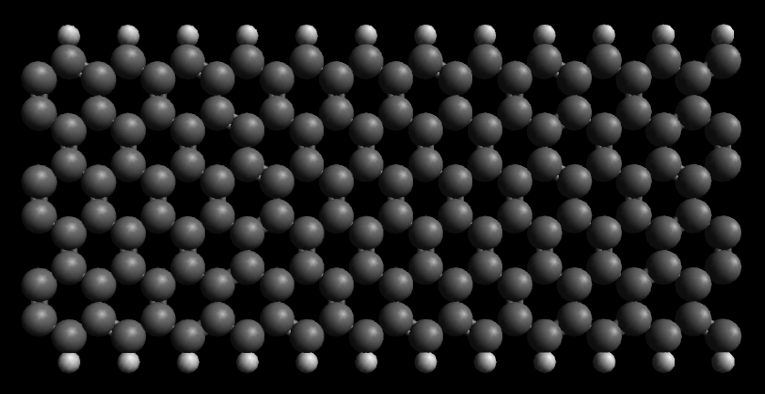
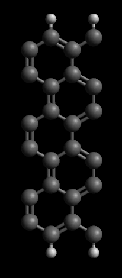
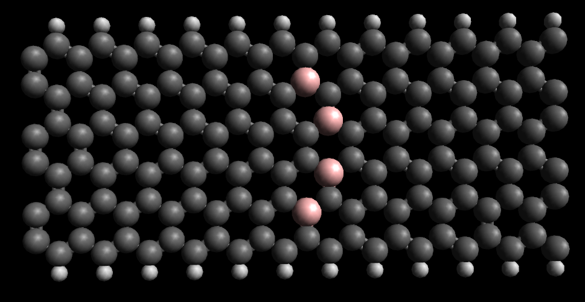
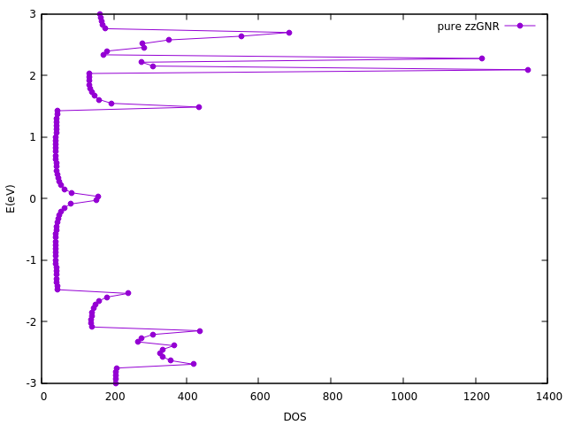
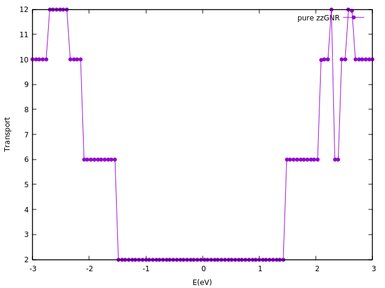
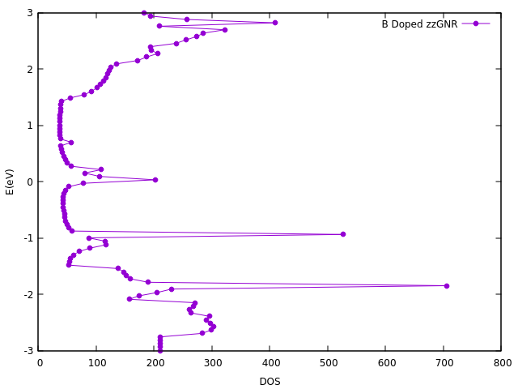
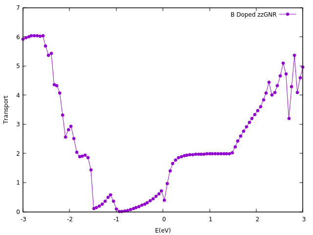
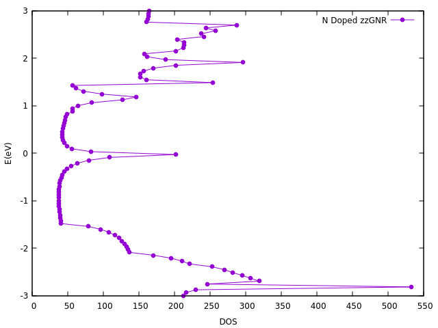
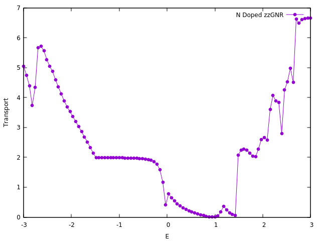

#### Doping Graphene Nano Ribbon(GNR) with Nitrogen and Bohr in order to reach semiconductor behavior 

##### basic description

In this project, the basic structure of zzGNR (with 12 layers, 12 Carbon and 2 Hydrogen atoms each -> total 168 atoms)  is considered

 

And the side 2 layers are used as electrodes

Electron transport and DOS for the pure zzGNR and the doped one is simulated using SIESTA/TRanSIESTA software. The doping positions is shown in the picture below

##### Software material

- SIESTA Package version 4.0 is used for the simulations.

- Avogadro Software is used to visualize the atomic structure
- GnuPlot is used to plot the results

##### Method

GGA/PBE method is used

##### Geometric notes

C-C bond length of 1.433600 Ang is used and C-H bond length of 0.75*1.433600 Ang

After some unsuccessful tries to Relax the structure (divergence of SCF algorithm) , duo to unfamiliarity  with Geometric optimization algorithms, we gave up this part

##### Results 

The DOS and electron transport for the pure zzGNR

note that in the results, E is actually: E-E_f

and Bias (V) = 0

After doping with 4 Bohr atoms in certain positions, as it's visible in the DOS, some states are appeared below the fermi level; so the B doped zzGNR can show behavior  of a p-type semiconductor

And so for the N doped case, the density of states, is stronger ahead of the fermi level.

